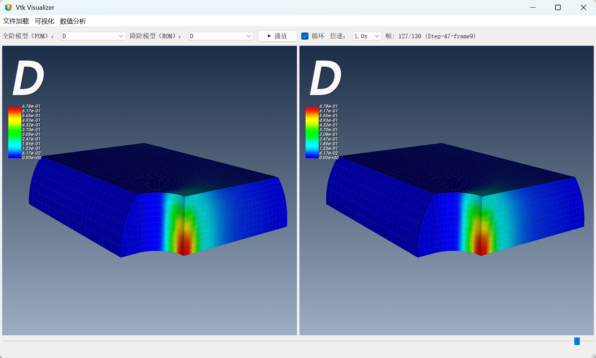

# ODB VTK Visualizer

基于 PyQt5、VTK 和 Matplotlib 的物理场可视化与分析工具。



## 主要功能

全阶/降阶模型多物理场云图渲染、动画播放、可视化设置与数值分析。

## 项目结构

```text
odb-vtk-visualizer/
├── assets/                         # 图标、界面示例和内置中文字体
├── data/                           # 本地示例/分析数据（默认被 Git 忽略）
├── script/
│   ├── odb_output_csv.py           # 从 ODB 直接导出 CSV
│   ├── odb_output_rpt.py           # 从 ODB 逐帧导出 RPT
│   └── com_physical_field_matrix.py # 将 RPT 合并为 CSV
├── vtk_visualizer.py               # GUI 主程序
├── requirements.txt                # Python 依赖
└── README.md
```

## 环境要求

- Python 3.x
- 安装依赖：

```bash
pip install -r requirements.txt
```

## 使用方法

### 数据准备

在 Abaqus/CAE 中执行脚本（File -> Run Script）：

- `script/odb_output_csv.py`：直接从 `.odb` 导出 `.csv`。
- `script/odb_output_rpt.py`：导出每一帧 `.rpt`，再用 `script/com_physical_field_matrix.py` 合并为 `.csv`。

脚本里的 `odbpath` / `var` / `var_choose` 等参数需要按实际模型配置。

### 运行可视化

运行：`python vtk_visualizer.py`，依次加载 `.inp`、FOM `.csv`、ROM `.csv`。